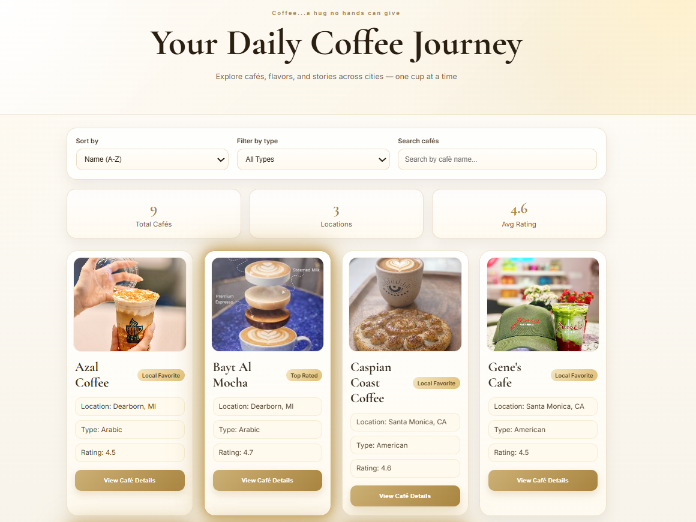

# ☕ Coffee Catalog — Snap Engineering Academy Project

Welcome to the Coffee Catalog, an interactive web application where users can explore different cafés, discover their unique vibes, and find their next favorite coffee spot. ✨

I built this project for Snap Academy using HTML, CSS, and JavaScript.

Here is a sneak peek of my app...


---

## 🧠 Project Features

☕ **Data Catalog**  
Browse a curated list of cafés with details like location, type, rating, vibe, and signature drinks.

🔎 **Search**  
Instantly search cafés by name to quickly find what you're looking for.

🎛 **Filtering**  
Filter cafés by type (Yemeni, Arabic, American) to match your preference.

🔢 **Sorting**  
Sort cafés alphabetically or by rating to explore top spots easily.

🧾 **Dynamic Rendering**  
Cafés are generated dynamically using JavaScript and displayed as interactive cards.

📊 **Stats Panel**  
Live statistics update based on displayed results, including:

- Total cafés
- Unique locations
- Average rating

🪟 **Modal Experience**  
Click on a café to open a detailed modal with:

- Description
- Signature drink
- Atmosphere/vibe
- Image gallery

🎨 **Modern UI Design**  
Elegant gold-themed design with smooth interactions and polished layout.

📱 **Responsive Design**  
Optimized for desktop, tablet, and mobile screens.

---

## 🧩 Technologies Used

- HTML5
- CSS3 (Grid, Flexbox, Responsive Design)
- JavaScript (ES6+, DOM Manipulation, Event Handling)

---

## 🚀 How to Run

1. Clone or download this repository
2. Open `index.html` in your browser

Or view the live version:

👉 https://alomari12.github.io/Snap-Project/

---

## 📚 Data Structure

All café data is stored in an array of objects inside `scripts.js`.

Example:

```js
{
  name: "Qahwah House",
  location: "Dearborn",
  type: "Yemeni",
  rating: 4.8,
  image: "images/qahwah-house-main.jpg",
  gallery: [
    "images/qahwah-house-1.jpg",
    "images/qahwah-house-2.jpg"
  ],
  description: "...",
  drink: "...",
  vibe: "..."
}

## 💡 Why I Built This

Every morning, this is where your journey begins, just like mine!  
Or maybe it’s on a quiet weekend,  meeting someone close to your heart, spending time with family, or simply enjoying a moment to yourself.

I built this to capture that feeling ,  a simple café catalog where you can explore places based on your own preferences.

☕ Every café has a story — maybe this helps you find yours.
— Ahmed, your morning coffee friend
